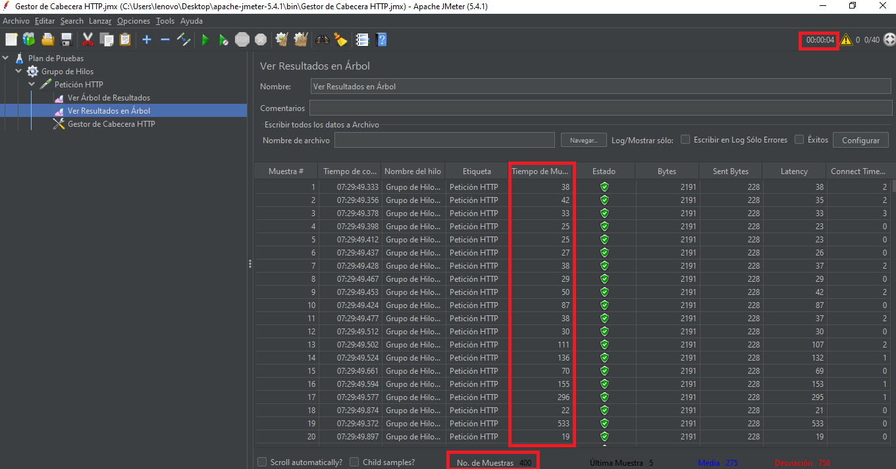
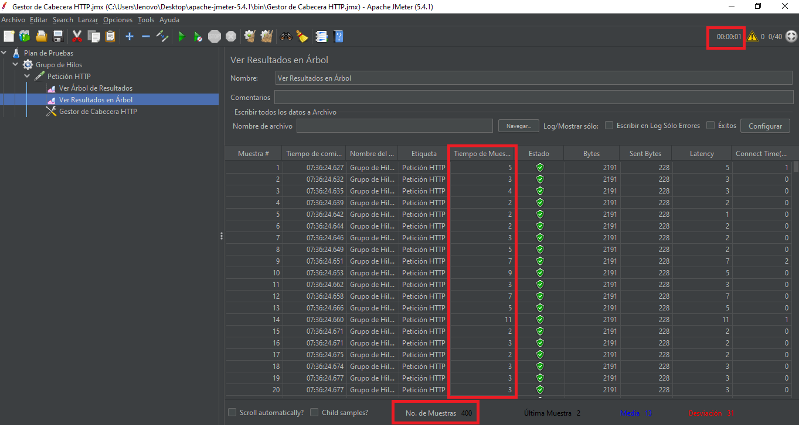
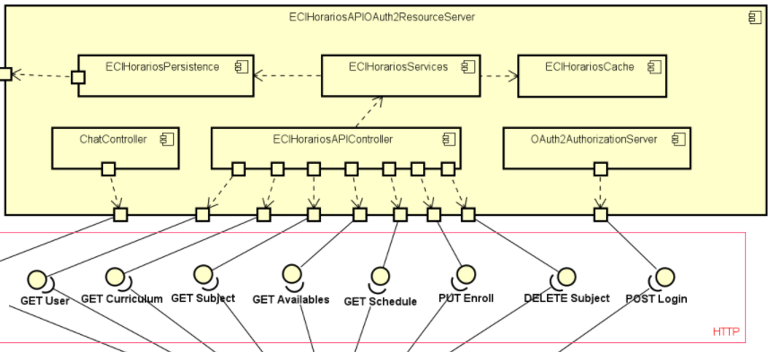
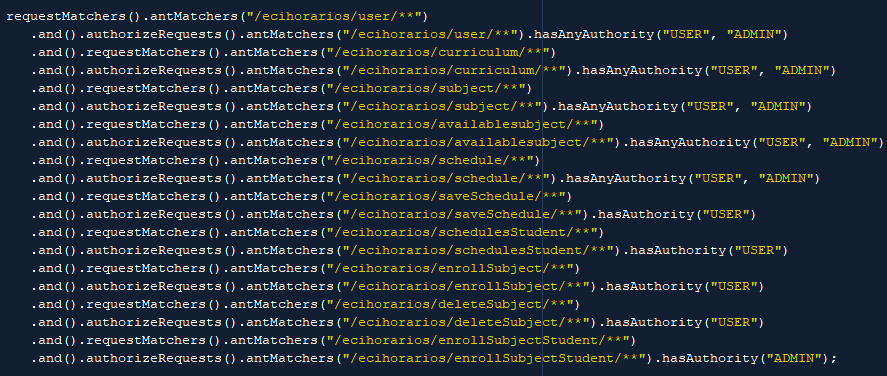

# ***Atributos No Funcionales*** 

## Rendimiento 
### Escenario 1 
* **Fuente del estímulo** : El usuario final. 
* **Estimulo**: Consultar curriculum 
* **Ambiente**: En operaciones normales. 
* **Artefacto**: ECIHorariosAPI.
* **Respuesta**: Consulta satisfactoriamente.
* **Medida de Respuesta** : Tiempo que le tomó realizar las peticiones.  

### Escenario 2
* **Fuente del estímulo** : El usuario final. 
* **Estimulo**: Consultar curriculum 
* **Ambiente**: En operaciones con cache. 
* **Artefacto**: ECIHorariosAPI.
* **Respuesta**: Consulta satisfactoriamente.
* **Medida de Respuesta** : Tiempo que le tomó realizar las peticiones.

### Descripción 
Una de las funcionalidades más importantes es la de consultar asignaturas disponibles la cual para poder realizar esto se debe consultar el plan de estudios de la carrera del estudiante, las asignaturas aprobadas del mismo,  y la información de las asignaturas. Gracias a las bases de datos Mongo el plan de estudios es fácil de representar, teniendo así la forma de un grafo.  

``` 
    db.Curriculum.insert(
	{ "_id" : "Ingenieria de Sistemas" ,
	  "list": [ {"code":"OGR1" , 
			"prerequisites": ["SIML"]
			},
			{"code":"OGR2" ,
				"prerequisites": ["SIML"]	
			}, 
			{"code":"ETO2"} ,
			{"code":"ETO3"} ,
			{"code":"SIML"} ,
			{"code":"IETI",
				"prerequisites": ["ARSW","AUPN"]
			}, 
			{"code":"ETO1"}, 
			{"code":"AREP" ,
				"prerequisites": ["CVDS","AUPN","RECO"]
			}, 
			{"code":"FDGP",
				"prerequisites": ["FCFI"]
			}
      			
			...
      			...
``` 
Pero esto podría llegar a ser muy costoso, si se realizan muchas peticiones para consultar las asignaturas disponibles, el proceso de mapeo de los planes de estudios y requerirlos a la base de datos es muy largo en términos  de peticiones concurrentemente, agregando que los planes de estudios tienen bastante información que almacenar. Por esta razón se implementa un cache en la api para que  no se realice todo este proceso si no este se memorice, también se implementa un cache para almacenar la información de las distintas asignaturas.
Para lograr esto se utiliza  la herramienta llamada Apache JMeter que nos facilitara realizar un conjunto de  peticiones. Y se dispondrá de un endpoint para consultar los planes de estudios. Teniendo los siguientes resultados. 

Resultados para el escenario 1
 

Resultados para el escenario 2 

Se puede ver que la reducción en tiempo fue bastante, para el primer escenario se obtuvo 4 segundos y para el segundo 1 segundo, además  para el tiempo entre cada petición disminuyo significativamente. Para obtener estos resultados se realizaron 400 peticiones a la api.  

## Seguridad 
 
### Escenario 1 
* **Fuente del estímulo** : El usuario final. 
* **Estimulo**: Registrar asignatura
* **Ambiente**: Sin protocolo OAuth2. 
* **Artefacto**: ECIHorariosAPI.
* **Respuesta**: Petición post satisfactoria.
* **Medida de Respuesta** : Petición http satisfactoria.  

### Escenario 2
* **Fuente del estímulo** : El usuario final. 
* **Estimulo**: Registrar asignatura.
* **Ambiente**: Con protocolo OAuth2. 
* **Artefacto**: ECIHorariosAPI.
* **Respuesta**: Petición post denegada.
* **Medida de Respuesta** : Petición http denegada. 
* 
### Descripción 
Para el atributo no funcional Seguridad se implemento el protocolo OAuth2 que consiste en delegar la autenticación de usuario al servicio que gestiona las cuentas, de modo que sea éste quien otorgue el acceso para las aplicaciones de terceros. OAuth 2 provee un flujo de autorización para aplicaciones web, aplicaciones móviles e incluso programas de escritorio. Este servicio también se encargar de administrar los recursos de una api permitiendole a distintintos roles usar determinados recursos. 
* Esquema  
  

* Recursos <br>


